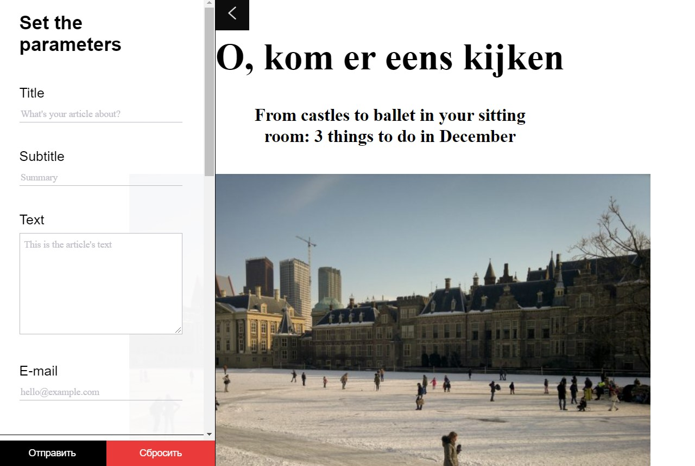

# :ballot_box_with_check: A page constructor via form in JS

You can fill in your own title, text, choose font and other styles.

A study project at Practicum by Yandex to try various form elements.

## :mag_right: Preview

---

## :link: Links to test

https://dianadomino24.github.io/form-page-constructor/

---

## :rocket: Technologies

-   **JavaScript ES6** - Promises, setTimeOut.

-   semantic **HTML5**, styles - **CSS3** including Flexbox.

-   **Objected Oriented Programming** - classes.

---

**Practicum by Yandex** - https://practicum.yandex.com/

---

## :sparkles: Thanks for watching! :sparkles:
